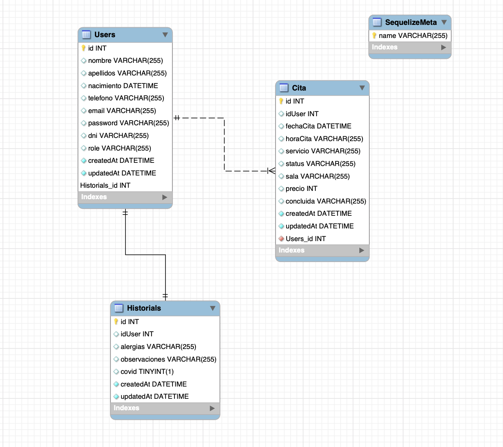

### ClinicaDentalBackEnd

Es un proyecto de backEnd de destion de citas de una clinica dental, donde el cliente se puede registrar, ver sus citas pendientes, crear una cita y anularla.

#### Tecnologías:
En este proyecto he usado NodeJS, Express y Sequelize.

#### EndPoints:
- Registro de usuario: / http://localhost:3345/api/user/createUser
- Login:/ http://localhost:3345/api/user/login
- Logout:/ http://localhost:3345/api/user/logout
- Crear cita:/ http://localhost:3345/api/cita/createCita
- Buscar cita pendiente:/ http://localhost:3345/api/cita/findCita
- Eliminar cita:/ http://localhost:3345/api/cita/remove

#### Relaciones entre tablas:

